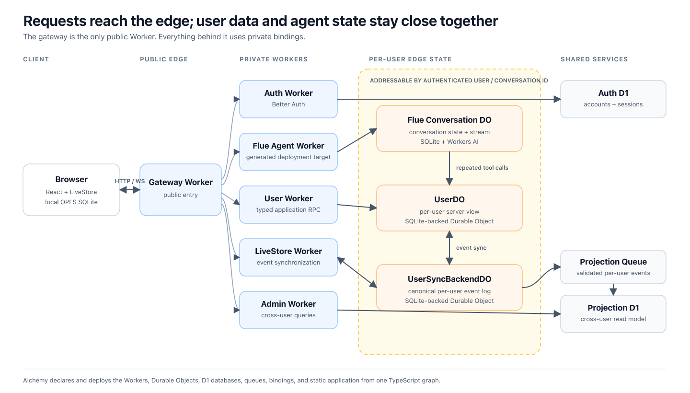

# Durable Notes

**A personal database per user, at the edge.**

Your app can run across a global edge network while its database still lives in
one place. Every request that touches that database travels back to it, adding
latency and pushing the architecture toward caches, session stores, connection
poolers, and more moving parts.

Durable Notes explores another shape: give every user their own SQLite
database in a Cloudflare Durable Object. Requests are routed to the user's
database, reads happen beside the compute that needs them, and writes for that
user naturally pass through one owner. The goal is not to replace every
central database—it is to find out how much simpler an application can become
when user-owned data has a natural home at the edge.

This repository builds the idea end to end: authentication, local-first data,
typed RPC, a streaming AI agent that can repeatedly work with user-owned data,
and a global deployment described in one TypeScript infrastructure file. It
also shows where the model breaks: cross-user queries, hot users, data
relocation, and migrations across a fleet of small databases.

> Companion repository for the technical deep dive **“Your Database,
> Everywhere.”**

## What the demo implements

- **Per-user SQLite databases** — an authenticated user ID deterministically
  selects a Durable Object with isolated storage. Once a request reaches that
  object, reads use local SQLite and writes pass through one coordination
  point.
- **Authenticated routing** — Better Auth manages accounts and sessions in D1.
  The public gateway verifies the user's JWT, derives their object identity,
  and reaches every other Worker through private bindings.
- **Local-first synchronization** — the browser has a local SQLite replica.
  LiveStore defines the event model, materializes application state, and syncs
  changes between browser and server without owning the per-user storage
  boundary.
- **Batched and pipelined RPC** — Cap'n Web provides typed RPC over HTTP and
  combines calls created in the same turn into one request. Dependent
  operations can also share one network round trip through promise pipelining.
- **Durable streaming agents without custom deployment machinery** — a Flue
  agent is authored as a TypeScript function. Flue and Vite generate the Worker
  entrypoint and conversation Durable Object; conversation state and the
  streaming connection live with that object, and accepted work resumes across
  restarts and deployments.
- **Agent and user data together at the edge** — the agent conversation runs
  on the same edge platform and reaches the user's database through an internal
  Durable Object binding. Tool-heavy runs avoid repeatedly crossing the public
  network to query a distant regional database, removing that latency from
  every data-dependent step of the agent loop.
- **Cross-user projections** — per-user events are sent through a queue and
  folded into D1. This is the explicit read model for queries that cannot be
  answered inside one user's database.
- **One TypeScript infrastructure graph** — Alchemy deploys the six Workers,
  Durable Objects, D1 databases, queues, bindings, static application, and
  preview environments together.

## Architecture



The gateway is the only public Worker. Everything behind it is reached through
Cloudflare service or Durable Object bindings. The user-facing database is the
pair of per-user DO instances in the center: one canonical event log and one
server-side materialized view. LiveStore connects those stores to the browser;
it does not create the tenancy or persistence boundary. The
[detailed architecture guide](docs/architecture.md) documents trust boundaries,
worker ownership, and complete request paths.

## Tech stack

| Layer                 | Technology                                                                              | Responsibility in this demo                                                                                        |
| --------------------- | --------------------------------------------------------------------------------------- | ------------------------------------------------------------------------------------------------------------------ |
| Edge runtime          | [Cloudflare Workers](https://developers.cloudflare.com/workers/)                        | Public gateway and isolated auth, user, admin, sync, and agent services                                            |
| Personal persistence  | [Durable Objects](https://developers.cloudflare.com/durable-objects/) + embedded SQLite | Deterministic per-user identity, execution and coordination, canonical event storage, and server-side view storage |
| Event model and sync  | [LiveStore](https://livestore.dev/)                                                     | Typed events and materializers, browser OPFS SQLite, WebSocket sync, and DO-to-DO live pull                        |
| Agents                | [Flue 2.0](https://flueframework.com/blog/flue-2/) + Workers AI                         | One generated DO per conversation, durable admission and transcript, streaming, inference, and user-data tools     |
| RPC                   | [Cap'n Web](https://github.com/cloudflare/capnweb)                                      | Typed, batched HTTP RPC for user and admin control-plane calls                                                     |
| Auth                  | [Better Auth](https://www.better-auth.com/) + D1                                        | Accounts, credential/Google sign-in, sessions, JWTs, and roles                                                     |
| Cross-user read model | Cloudflare Queues + D1 + Drizzle                                                        | Asynchronous, idempotent projections for administrative queries                                                    |
| Example UI            | React, Vite, assistant-ui, and BlockNote                                                | A concrete client for exercising local-first data and agent streaming                                              |
| Infrastructure        | [Alchemy](https://alchemy.run/)                                                         | The complete Cloudflare resource graph and deployments in TypeScript                                               |

## Where this shape breaks

- A Durable Object does not automatically follow a traveling user. Relocating
  it requires application code to coordinate new placement, transfer its
  state, and switch routing.
- One object is one coordination point, so it is a poor boundary for a hot
  tenant that must accept high write concurrency from many regions.
- Cross-user joins do not fit the per-user database boundary. This demo builds
  an eventually consistent D1 projection for those queries.
- Schema evolution, backups, exports, deletion, and observability must work
  across two Durable Object instances per user rather than one central
  database.

Those constraints are part of the demo, not footnotes. Treat this repository as
a forkable experiment and talk companion, not a production reference
architecture.

## Quick start

Install [Nub](https://nubjs.com/docs) first, then:

```sh
nub install
nub install --cwd infra
```

`.env.schema` is the configuration contract. In a gitignored `.env.local`, set
`BETTER_AUTH_SECRET` to a secret of at least 32 characters and add the web
client credentials for a Google OAuth app whose redirect URI is
`http://localhost:8787/api/auth/callback/google`. Prefer 1Password `op(...)`
references or let Varlock prompt for and encrypt device-local values:

```dotenv
BETTER_AUTH_SECRET=varlock(prompt)
GOOGLE_CLIENT_ID=your-local-web-client-id
GOOGLE_CLIENT_SECRET=varlock(prompt)
```

Then validate the configuration without exposing the secret:

```sh
nub run env:check
```

The current agent uses Cloudflare Workers AI through an Alchemy binding, so
local full-stack development does not require a separate model-provider API
key. Alchemy injects the resolved auth secret only into the auth Worker.

## Run the local stack

```sh
nub run dev
```

Alchemy runs six Workers: gateway, auth, LiveStore, user, admin, and the Flue
agent. It also manages the separate auth/admin D1 databases and the projection
queue. The agent is an Alchemy-managed Vite Worker in the same development
loop, so agent edits retain Vite HMR. In local development the gateway reaches
it through a deterministic loopback origin; deployed stacks use the agent
service binding. The gateway remains the only public entry at
`http://localhost:8787`.

The first run may ask to bootstrap Alchemy's Cloudflare-backed state store.
State is shared for deploys but remains isolated by each developer's default
Alchemy stage.

D1 migrations and the auth-only `db/auth/seeds/local.sql` are applied
automatically; the local databases persist between runs and are separate from
deployed D1 data.

Each user's canonical note, item, and conversation-catalog events are stored in
their `UserSyncBackendDO` SQLite database. LiveStore materializes those events
as tables in the browser and `UserDO`. In the web app, one note ID is also one
Flue conversation ID: the left rail selects the note, assistant-ui renders its
chat in the center, and BlockNote edits its Markdown on the right. BlockNote's
slash menu includes tables, while the agent can create the same structures with
GFM Markdown. Validated events flow through one projection queue into the admin
D1 read model. After changing a D1 projection or auth schema, run
`nub run db:generate`; Alchemy applies the independent auth and admin
migrations.

Alchemy's local D1 seed creates two real Better Auth credential users:

| Role  | Email                   | Password            |
| ----- | ----------------------- | ------------------- |
| admin | `demo-admin@local.test` | `demo-password-123` |
| user  | `demo-user@local.test`  | `demo-password-123` |

Application data starts empty and is created through the same LiveStore path
used by the app. With the local stack running, exercise all public surfaces
with:

```sh
nub run smoke
```

Run one surface by itself when narrowing a failure:

```sh
nub run smoke:auth
nub run smoke:rpc
nub run smoke:realtime
nub run smoke:livestore
nub run smoke:projection
```

All smoke commands target `http://localhost:8787` by default. Set
`GATEWAY_ORIGIN` directly when testing another gateway.

## Notes agent API

The gateway exposes the Flue agent at
`/api/agents/hello/:conversationId`. Every request requires a Better Auth
bearer token. Clicking **New** creates a local-first note with an opaque ID; its
conversation does not exist until the first message. That message is sent with
Flue's create-only condition. After Flue durably admits it, the agent worker
adds the active conversation to the user's LiveStore catalog with the same ID
and a title derived from the message. Notes can therefore exist without chat,
but a chat selected in the app always belongs to exactly one note.

The official `@flue/react` client streams the external conversation state into
assistant-ui. A single user can own many notes for the same agent while each
note retains an independent Flue transcript. The catalog records ownership,
agent identity, and model-variant compatibility metadata when the first message
is admitted. Runtime model selection is currently server-owned and fixed to
Workers AI for every execution, including conversations whose historical
metadata says `openai`; callers cannot override it with prompt data.

Send a message with Flue's asynchronous conversation protocol:

```sh
curl -i http://localhost:8787/api/agents/hello/CONVERSATION_ID \
  -H 'Authorization: Bearer JWT' \
  -H 'Content-Type: application/json' \
  --data '{"kind":"user","body":"Draft a trip checklist as a table.","uid":null,"idempotencyKey":"first-message"}'
```

The `POST` returns `202` after durable admission. Read the streamed conversation
state from the same authenticated URL with `GET`. For an ID already in the
catalog, omit `uid` and `idempotencyKey` on later messages. The agent can call
`read_note` and `write_note`; both are bound to the conversation's matching note
ID and reach only the caller's per-user `UserDO` through its cross-worker
binding. Before Flue admits a create-only first prompt, the agent worker injects
the gateway-stamped owner, matching note ID, and server-selected model metadata
as server-owned creation data.

## Deploy

```sh
nub run deploy
```

Alchemy builds Flue's virtual Worker entry through Vite and deploys the
complete Worker topology in one plan.

### GitHub deployments

`.github/workflows/deploy.yml` runs linting, typechecking, and a production
build before deploying these isolated Alchemy stages:

| Git event                           | GitHub environment | Alchemy stage         |
| ----------------------------------- | ------------------ | --------------------- |
| Pull request to `main` or `staging` | `preview`          | `preview-pr-<number>` |
| Push to `staging`                   | `staging`          | `staging`             |
| Push to `main`                      | `production`       | `production`          |

Create the `preview`, `staging`, and `production` environments under
**Settings → Environments** in GitHub. Configure each with:

- `CLOUDFLARE_ACCOUNT_ID` as an environment variable.
- `CLOUDFLARE_API_TOKEN` as an environment secret.
- `BETTER_AUTH_SECRET` as an environment secret containing at least 32
  characters.

For `staging` and `production`, also configure:

- `GOOGLE_CLIENT_ID` as an environment variable.
- `GOOGLE_CLIENT_SECRET` as an environment secret.

The corresponding Google web clients must register the exact Better Auth
callback for each stable deployment host, ending in
`/api/auth/callback/google`. Pull-request previews intentionally omit these
values and hide Google sign-in because every preview receives a generated
hostname. Email/password authentication remains available there.

The same Cloudflare account and API token can be used for every environment;
Alchemy keeps their resources isolated by stage. A closed or merged pull
request automatically destroys its preview stage. For security, fork pull
requests run the checks but do not receive Cloudflare secrets or deploy.

## Start reading the code

- [`infra/alchemy.run.ts`](infra/alchemy.run.ts) declares the complete resource
  graph and every runtime binding.
- [`src/workers/livestore/user.do.ts`](src/workers/livestore/user.do.ts) is the
  server-side per-user LiveStore view and its application RPC surface.
- [`src/workers/livestore/user-sync-backend.do.ts`](src/workers/livestore/user-sync-backend.do.ts)
  owns the per-user event log and publishes cross-user projection events.
- [`src/workers/agent/agents/hello.agent.ts`](src/workers/agent/agents/hello.agent.ts)
  defines the streaming Flue agent in one TypeScript function.
- [`src/workers/agent/tools/notes.tool.ts`](src/workers/agent/tools/notes.tool.ts)
  shows how agent tools are constrained to the authenticated user's note.

## Learn more

- [Flue docs](https://flueframework.com/docs/) — or `nubx flue docs` from the
  terminal.
